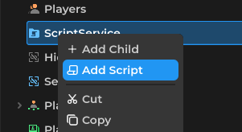
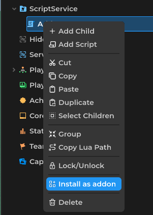

# Creating an Addon

Addons are useful scripts that let you create useful tools for the creator

> **Note:** Addons can only be used in the Creator

Create a new **script**:



Select a **Server** Script


Open the **Script** and register a new [AddonObject](../../api/types/addons/AddonObject/)
```lua
local addonObject = Addons:Register("Example")
addonObject.AddonName = "Example Addon"
```

## Addon Icon

Set an icon that will appear in the tools menu using a [PTImageAsset](../../api/types/assets/PTImageAsset/):

```lua
local icon = PTImageAsset.New()
icon.ImageID = 0
icon.ImageType = ImageType.Asset
addonObject.AddonIcon = icon
```

## Tool Items

Tool items appear in the addon's dropdown menu. Create them with `CreateToolItem` and listen for the `Pressed` event:

```lua
local myTool = addonObject:CreateToolItem("My Tool")

myTool.Pressed:Connect(function()
    print("Tool item pressed!")
end)
```

## Requesting Permissions

Some features require user permission. Prompt the player with `RequestPermissions` using the [AddonPermission](../../api/enums/AddonPermission/) enum:

```lua
addonObject:RequestPermissions({
    Enums.AddonPermission.IORead,
    Enums.AddonPermission.IOWrite
})
```

## Cleanup

When the creator updates or removes your addon, the `CleanupReceived` event fires. Use this to clean up any resources:

```lua
addonObject.CleanupReceived:Connect(function()
    -- clean up GUI elements, connections, etc.
end)
```

## Working with Selections

Use [CreatorSelections](../../api/types/addons/CreatorSelections/) to interact with the creator's selection system:

```lua
-- Select a specific instance
Selections:Select(somePart)

-- Get all selected instances
local selected = Selections:GetSelected()

-- Deselect all, then select only this instance
Selections:SelectOnly(somePart)

-- Deselect everything
Selections:DeselectAll()
```

Listen for selection changes:

```lua
Selections.Selected:Connect(function()
    print("Something was selected")
end)

Selections.Deselected:Connect(function()
    print("Something was deselected")
end)
```

## Undo and Redo

[CreatorHistory](../../api/types/addons/CreatorHistory/) lets you add undo/redo support to your addon:

```lua
History:NewAction("My Action")

History:AddDoCallback(function()
    -- redo logic
end)

History:AddUndoCallback(function()
    -- undo logic
end)

History:CommitAction()
```

## Overlaying GUI

[CreatorGUI](../../api/types/addons/CreatorGUI/) allows you to overlay UI on top of the creator viewport. Create a GUI and parent it to the CreatorGUI object:

```lua
local gui = Instance.New("GUI")
local UIView = Instance.New("UIView") -- for a visual queue
UIView.Parent = gui
gui.Parent = CreatorGUI
```

## Reading Creator State

[CreatorInterface](../../api/types/addons/CreatorInterface/) provides information about the current creator state:

```lua
print("Current tool mode:", Creator.Interface.ToolMode)
print("Target part color:", Creator.Interface.TargetPartColor)
print("Move snapping:", Creator.Interface.MoveSnapping)
```

## Installing the Addon

Once your script is ready, install it as an addon:



The addon will now appear in the creator's tools menu under the name you set with `AddonName`.


